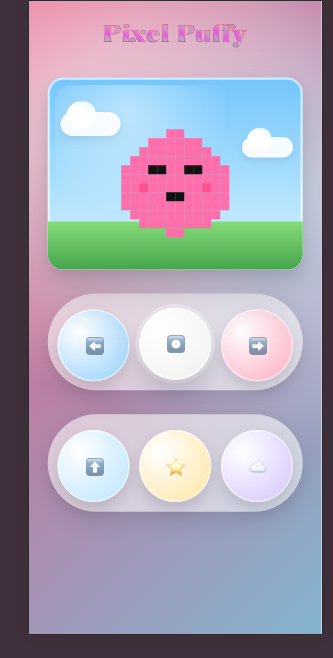

# Week 1 
## Dag 1 - CSS Challenge
Vandaag werkte ik samen met mijn groep, bestaande uit Paton, Melvin en Mitchell.
We kregen een CSS-challenge en bekeken eerst het thema dat aan onze groep was toegewezen.

Ik koos ervoor om te werken met mask en filter in CSS. Dit waren technieken waar ik nog niet eerder mee had gewerkt. Op basis van de naam dacht ik dat ze vooral met kleuren te maken hadden – en dat bleek inderdaad zo te zijn.

De uitdaging was om iets te maken zonder div elementen, zonder afbeeldingen en zonder javascript. Alles moest dus puur met CSS worden opgebouwd.

Persoonlijk vind ik werken met CSS-selectors niet moeilijk; ik vind het juist leuk en creatief. Maar wanneer het niveau hoger wordt, merk ik wel dat het complexer wordt.

Het was lastig om een idee te bedenken. Ik vind het soms moeilijk om een concept te starten, maar ik probeerde inspiratie te halen uit de bronnen die bij ons thema stonden. Ik vond een interessant effect dat leek op een soort “gooey” effect, waarbij vormen visueel samenkomen en weer uit elkaar vloeien. Het zag er indrukwekkend uit, maar ook vrij complex.

Omdat ik merkte dat de tijd snel ging, besloot ik me eerst goed te verdiepen in wat filter en mask precies doen en waarvoor je ze gebruikt. Daarna probeerde ik zelf een eerste experiment te maken.

## Dag 2

In de ochtend begonnen we met presentaties waarin iedereen liet zien wat hij of zij de dag ervoor had gemaakt.

Dit was mijn resultaat van dag 1. Gezien de beperkte tijd was het een passend experiment. Mijn oorspronkelijke idee was om een echt “gooey effect” te maken, maar dat bleek meer tijd te kosten dan verwacht. Daarom heb ik mijn plan aangepast.

Tijdens het werken heb ik geleerd:

Hoe een CSS-filter daadwerkelijk invloed heeft op de kleuren en visuele uitstraling van een element

Hoe een mask werkt en hoe je kunt bepalen welk deel van een element zichtbaar is en welk deel niet

Hoe je met een radial-gradient() een mask kunt opbouwen met een vloeiende overgang

Bijvoorbeeld:
mask-image: radial-gradient(
  circle at 30% 25%,
  rgba(0, 0, 0, 1) 55%,
  rgba(0, 0, 0, .55) 70%,
  rgba(0, 0, 0, 0) 85%
);
Wat ik interessant vond, is dat het werken met mask en filter mij deed denken aan effecten in Figma. Ik had niet verwacht dat je met pure CSS zulke visuele effecten kunt maken.

Na de presentatie hadden we de kickoff van het vak.
Daarna heb ik de vier oefeningen doorgenomen. Ik twijfelde tussen opdracht 1 en opdracht 4, maar uiteindelijk sprak opdracht 1 mij meer aan. Ik vond het prettig dat ik hier volledige controle had zonder JavaScript te gebruiken.

Van alle ideeën in de control panel koos ik voor het piano-concept. Het lijkt mij leuk om iets soortgelijks te maken en verder uit te werken.

## Woensdag 4 maart:

### Wat heb ik vandaag gedaan?

Vandaag heb ik verder gewerkt aan de interactieve interface van mijn project.
Ik heb knoppen gemaakt voor **beweging** (links, midden, rechts) en **acties** (springen, power en thema). Deze knoppen zijn gekoppeld aan verborgen radio buttons en checkboxes.

Daarna heb ik met CSS de interactie toegevoegd. Met `:checked` kan de positie van het karakter veranderen, bijvoorbeeld naar links of rechts bewegen of omhoog springen.

In de tweede helft van het werk heb ik een **pixel-art karakter** gemaakt. Hiervoor heb ik een grid van **12 × 12 (144 spans)** gebruikt. Met `nth-child()` heb ik specifieke pixels gekleurd om stap voor stap de vorm van het karakter te tekenen.

### Hoeveel tijd heeft me dat gekost?

Ongeveer 3–4 uur.
Een groot deel van de tijd ging naar het testen en aanpassen van de pixel-vorm totdat het karakter er herkenbaar uitzag.

### Wat heb ik geleerd?

Vandaag heb ik geleerd dat CSS niet alleen voor styling is, maar ook voor **interactie** kan worden gebruikt via `:checked`.

Daarnaast heb ik een nieuwe techniek geleerd: **pixel-art maken met CSS grid en spans**. Hierbij moet je goed nadenken over de positie van elke pixel en vaak iteratief aanpassen.

### Wat ga ik morgen doen?

Morgen wil ik het karakter verder verbeteren door:

* de vorm en het gezicht duidelijker te maken
* extra visuele effecten toe te voegen
* en de animaties van de acties (zoals jump en power) verder te verfijnen.

## Feedback voortgangsgesprek - 6 maart 

 

Tijdens het voortgangsgesprek kreeg ik positieve feedback op mijn huidige werk en de vooruitgang van het project. Ik was zelf ook tevreden met hoe het tot nu toe verloopt en hoe het project zich ontwikkelt.

Ik moet meer aandacht besteden aan de focus-states en de interactie van de inputs.  
Bijvoorbeeld dat knoppen duidelijk laten zien wanneer ze worden aangeklikt of geselecteerd.

Omdat ik nu vooral met  elementen werk voor de weergave van het gezicht, gaf Sanne aan dat ik ook **inputs kan gebruiken voor interactie**. Dit kan bijvoorbeeld handig zijn wanneer ik beweging of acties wil maken (zoals links, rechts of springen).

Een mogelijke aanpak is om de standaardstijl van de input te verwijderen en de input boven een label te plaatsen:

/* label {
  position: relative;
}

input {
  appearance: none;
  width: 4em;
  height: 4em;
  margin: 0;
  inset: 0;
  position: absolute;
}

input:checked {
  background-color: blue;
} */

CSS-criteria van de opdracht

We bespraken ook een van de criteria van de opdracht:

/* Use at least two of following CSS techniques
in a useful way: CSS nesting, @layer, container
queries, style queries, @function, if(). */

Sanne adviseerde om minstens twee of drie van deze technieken te gebruiken.
Ze liet ook voorbeelden zien op DLO waar we inspiratie uit kunnen halen.

## Voortgangsgesprek – 12 maart

Tijdens het voortgangsgesprek heb ik mijn huidige werk laten zien. Het was een prettig gesprek en ik vond het ook interessant om het werk van de andere studenten te bekijken. Zij hadden ook mooie resultaten.

Ik heb laten zien waar ik deze week aan heb gewerkt. Tot nu toe heb ik het gezicht van het personage goed gepositioneerd en een animatie gemaakt voor het springen omhoog. Daarnaast ben ik begonnen met de animatie voor beweging naar links en rechts. Op dit moment beweegt alleen het hoofd naar links en rechts, maar de positie van het personage zelf verandert nog niet.

Verder heb ik wolken toegevoegd aan de achtergrond. Dit heb ik gemaakt met een `div` waarin twee `span`-elementen zitten. Met behulp van `::before` en `::after` en `box-shadow` heb ik extra cirkels toegevoegd, waardoor samen de vorm van een wolk ontstaat.

## Vrijdag ​​maart 13 

Vandaag heb ik een titel bovenaan het dashboard toegevoegd: **Pixel Puffy**.

Hiervoor heb ik bewust een pakkend en speels lettertype gekozen dat past bij de stijl van mijn project.

/Users/ayabarni/Desktop/Scherm­afbeelding 2026-03-17 om 18.45.57.png

Ik heb ook een tweede thema toegevoegd.

In plaats van de gebruikelijke donkere modus heb ik gekozen voor het **Regenthema**.

Wanneer de gebruiker op de regenknop drukt, verandert de sfeer van de gebruikersinterface:

- De achtergrond wordt donker.
- De lucht op het scherm verandert van kleur.
- Er verschijnt regen op het scherm.
/Users/ayabarni/Desktop/Scherm­afbeelding 2026-03-17 om 21.53.01.png

Ik heb ook **Container Queries** geïmplementeerd om mijn ontwerp responsief te maken.

In plaats van rekening te houden met de schermgrootte, past het ontwerp zich aan de containergrootte aan. Ik heb `<main>` als container ingesteld en een containerquery gebruikt om te bepalen wanneer de lay-out moet veranderen:

- Op kleine schermen worden alle elementen verticaal gestapeld.

- Met meer ruimte verschijnt het scherm aan de linkerkant en de knoppen aan de rechterkant.

# Week 4

## 18 maart Woensdag

### 1. Lettertype en animatie
Vandaag heb ik het lettertype aangepast.
/Users/ayabarni/Desktop/Scherm­afbeelding 2026-03-18 om 13.24.06.png

Het vorige lettertype was niet geschikt voor het spel, dus heb ik gekozen voor een pixelachtig lettertype dat beter bij het ontwerp past.

Daarnaast heb ik een eenvoudige, subtiele animatie aan de titel toegevoegd, waardoor het ontwerp dynamischer oogt.
@keyframes font{
    0%, 100% {
        transform: translateY(0);
    }
    50% {
        transform: translateY(-8px);
    }
}

## 2. Lay-out en responsiviteit
Verder heb ik gewerkt aan de lay-out en responsiviteit van het bedieningspaneel.
Tijdens het testen op verschillende schermformaten merkte ik dat de lay-out niet consistent was.

/Users/ayabarni/Desktop/Scherm­afbeelding 2026-03-18 om 11.08.50.png 
/Users/ayabarni/Desktop/Scherm­afbeelding 2026-03-18 om 11.08.55.png
De paginalay-out veranderde en er verscheen ongewenste witruimte en inconsistente verhoudingen. Om dit te verbeteren heb ik het volgende gedaan:

- De afmetingen van de verschillende elementen gecontroleerd
- De labelgroottes aangepast zodat ze beter bij de knoppen passen
- Margin toegevoegd aan de body voor meer ruimte
Het resultaat is dat het ontwerp consistenter en visueel beter in balans is op verschillende schermformaten.
 
